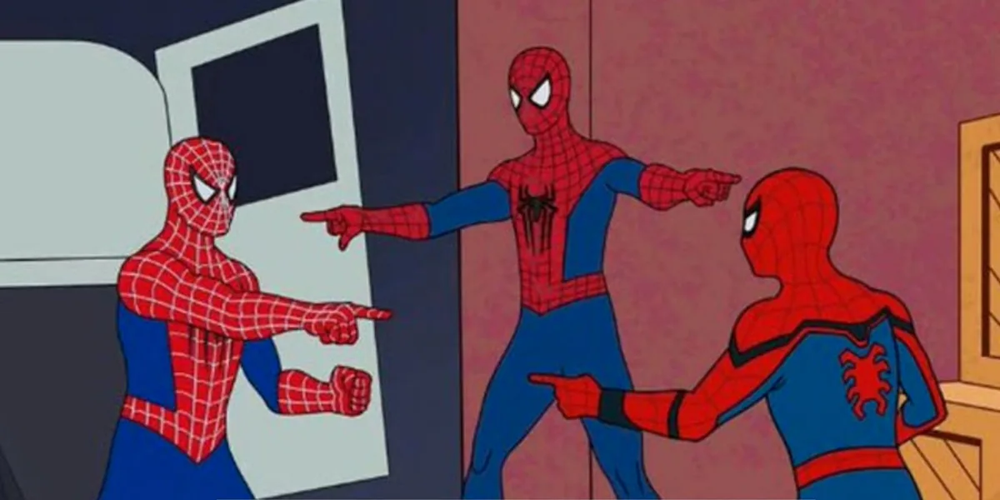

# probabilistic-reflex-suppressor

<p align="center">
  
</p>

`probabilistic-reflex-suppressor` counts people in one image and applies an auditable heuristic to avoid counting a likely mirror reflection as an additional real person. It is a small, vendor-agnostic Python project: the default backend uses OpenCV's built-in HOG person detector, while the pipeline accepts any detector implementing the project protocol.

## Project status and intent

This repository is an applied computer-vision experiment focused on real-world people-counting problems, with the specific goal of minimizing counting noise caused by mirror and glass reflections. It is intended to make assumptions, uncertainty, false positives, and false negatives measurable and auditable while the approach is iteratively evaluated.

The project currently requires additional engineering and evaluation hours before it should be considered a production candidate. Production readiness would require representative and consented validation data, calibrated person and surface models, robustness testing across scenes and devices, performance and resource benchmarks, dependency and model-license review, operational monitoring, and an explicit error tolerance agreed with the deployment owner.

## Important limitation

One image does not contain enough information to prove whether a figure is a real person or a reflection. The reflection step is therefore probabilistic. The current implementation first looks for local mirror evidence, such as a long straight mirror boundary or panel edge. Only then does it consider two detections that are geometrically mirrored around a candidate vertical axis between them and have similar image appearance. If mirror evidence is absent, both detections remain counted. Symmetric real people, unusual mirrors, occlusion, detector errors, and non-central mirrors can produce false positives or false negatives. For production use, calibrate against representative, consented data and consider a temporal/video model or a dedicated trained detector.

## Architecture

1. `OpenCVHOGPersonDetector` converts an image into raw person bounding boxes.
2. `PersonCountingPipeline` validates and de-duplicates detections.
3. `ReflectionSuppressor` combines local mirror-boundary evidence with geometry and crop appearance.
4. The CLI prints a JSON result to the terminal and can also write the same JSON to a file.

The detector is injected through a protocol, so a YOLO, ONNX, cloud, or custom model can be added without changing the counting or output layers. No cloud provider is required.

### Experimental surface-mask extension

The default fallback does not require a mirror or glass segmentation model. An experimental extension accepts externally generated grayscale masks through `--mirror-mask` and `--glass-mask`; non-zero pixels are treated as the corresponding surface. This mode is not required for the standard command, and no model-generated mask is included in the repository. A detection with substantial surface overlap is tagged `surface_overlap_uncertain` and remains counted unless reflection association also provides enough evidence to suppress it.

Surface segmentation remains a future research extension. The relevant literature models mirror and glass regions from contextual, semantic, symmetry, or depth cues rather than treating them as ordinary texture: [Mirror and Glass Detection/Segmentation project page](https://www.cs.cityu.edu.hk/~rynson/projects/mirror_glass/MirrorGlassDetection.html).

```bash
make run ARGS="input/test4.jpg --mirror-mask input/masks/test4-mirror-mask.png --annotated-output output/test4-mask-aware.png --output output/test4-mask-aware.json"
```

Replace the example mask path with an existing grayscale mask file if using this experimental mode. Mask dimensions must match the input image. The JSON includes the mask source, confidence, pixel totals, each detection's surface overlap, and its dominant surface type. To validate the extension without creating a mask file, run `make test`, which uses deterministic synthetic masks.
Copy or generate the mask under `input/masks/` before running the command. Docker mounts only the repository at `/workspace`, so paths outside the repository are intentionally unavailable to the application.

## Quick start

### Docker-first development

The Makefile executes project commands in disposable containers. The host only needs Docker; no host Python, virtual environment, or package installation is required.

Build the development image:

```bash
make install
```

Run an image through the ephemeral runtime:

```bash
make run ARGS="path/to/image.jpg"
make run ARGS="path/to/image.jpg --output output/result.json"
make run ARGS="path/to/image.jpg --output output/result.json --annotated-output output/annotated.png"
make run ARGS="path/to/image.jpg --mirror-evidence-threshold 0.35 --annotated-output output/annotated.png"
make run ARGS="path/to/image.jpg --min-edge-density 0.02 --min-contrast 0.10 --annotated-output output/annotated.png"

# Convenience target with explicit Make arguments
make annotate INPUT=input/test.jpg ANNOTATED_OUTPUT=output/test-annotated.png
```

The command prints JSON like:

```json
{
  "image": "path/to/image.jpg",
  "count": 1,
  "detections": [
    {
      "index": 0,
      "tag": "counted_person",
      "counted": true,
      "paired_index": null,
      "label": "person",
      "confidence": 0.91,
      "box": {"x": 12, "y": 20, "width": 80, "height": 160}
    }
  ],
  "suppressed_reflections": [],
  "warnings": []
}
```

When a likely duplicate is found, its detection remains in the JSON with the tag `mirror_reflection` and `counted: false`. The annotated image uses green boxes for counted people and red boxes for mirror reflections.

### Option B: Docker

Build the production image directly when a standalone runtime image is needed:

```bash
docker build -t probabilistic-reflex-suppressor .
docker run --rm -v "$PWD:/workspace" probabilistic-reflex-suppressor /workspace/image.jpg --output /workspace/output/result.json
```

The container includes the pinned application dependency range and does not depend on the host Python installation.

## Development commands

```bash
make install       # build the disposable development image
make format        # format Python files in an ephemeral container
make format-check  # verify formatting without changing files
make lint          # run Ruff in an ephemeral container
make typecheck     # run mypy in an ephemeral container
make test          # run tests in an ephemeral container
make check         # run all quality gates in ephemeral containers
```

## Tests and synthetic strategy

Tests do not require photographs. They create small NumPy images, experimental masks, and injected fake detectors, allowing both the fallback reflection logic and the mask extension to be tested without depending on model weights or network access. The suite covers bounding-box math, mask overlap, surface-aware reflection suppression, symmetric reflection suppression, non-reflection pairs, pipeline composition, CLI output, invalid inputs, and output-file writing. Add new scenarios as focused tests under `tests/` and keep detector-specific tests separate from core counting behavior.

## Repository map

- `src/probabilistic_reflex_suppressor/`: typed application code and CLI.
- `input/generated/`: generated mirror/reflection images for synthetic experiments.
- `tests/`: unit and integration tests, including synthetic fixtures.
- `docs/architecture.md`: design decisions and extension points.
- `docs/testing.md`: test strategy and calibration guidance.
- `skills/`: reusable, agent-neutral project skills for Python, computer vision, QA, and documentation work.
- `AGENTS.md`: contribution rules for coding agents and humans.

## License

This repository does not declare a license yet. Add the license that matches the intended distribution before publishing it.
